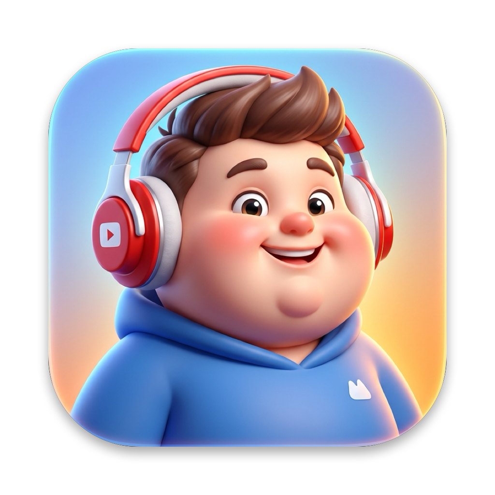

  

<h1 align="center">QDown</h1>

  Ứng dụng native tải video và âm thanh đa nền tảng (YouTube, TikTok, Facebook, Instagram…) hàng loạt cho macOS &amp; Windows. 
  Tự động vượt cơ chế chặn bot, giao diện đơn giản, tốc độ tối đa.

  
  &nbsp;&nbsp;
  
  &nbsp;&nbsp;
  

---

## 📥 Tải về

Chọn phiên bản phù hợp với thiết bị của bạn:

| Hệ điều hành | Dòng máy / Cấu hình | Định dạng | Link tải trực tiếp |
| :--- | :--- | :---: | :--- |
|  **macOS** | **Mac Apple Silicon** | `.dmg` | [Tải về QDown-1.0.8-AppleSilicon.dmg](https://github.com/beolamtat/qtube/releases/download/v1.0.8/QDown-1.0.8-AppleSilicon.dmg) |
|  **macOS** | **Mac chip Intel** | `.dmg` | [Tải về QDown-1.0.8-Intel.dmg](https://github.com/beolamtat/qtube/releases/download/v1.0.8/QDown-1.0.8-Intel.dmg) |
| 🪟 **Windows** | **Windows 10 / 11 (64-bit)** | `.exe` | [Tải về QDown-1.0.8-Windows-x64-Setup.exe](https://github.com/beolamtat/qtube/releases/download/v1.0.8/QDown-1.0.8-Windows-x64-Setup.exe) |

**Mới ở v1.0.8:**
- **Nhận diện thông minh & Hộp thoại YouTube Mix:** Tự động phát hiện các đài phát / danh sách kết hợp YouTube Mix (`RD...`, `UL...`, `PU...`) khi copy link, hiển thị lựa chọn thông minh *"Chỉ tải video này (Khuyên dùng)"* hoặc *"Xem & Tải toàn bộ danh sách Mix"*, tránh vô tình kéo hàng chục video gợi ý vào hàng chờ. Hỗ trợ lọc theo ca sĩ/nghệ sĩ trong danh sách.
- **Trích xuất liên kết chuẩn xác (Link Trimming):** Tự động lọc bỏ các dấu câu thừa ở cuối URL khi dán/sao chép (`. , ; ! ? ) ] } ' "`), tương thích trên cả macOS và Windows.
- **Cải tiến tự động cập nhật (Hot Update):**
  - Windows: Nâng cấp cơ chế cập nhật tự động chạy ngầm Inno Setup không hiển thị wizard (`/VERYSILENT`), tự động đóng và khởi động lại phiên bản mới mượt mà.
  - macOS: Ghi nhận lỗi và hiển thị thông báo chi tiết khi macOS App Management hạn chế quyền thay thế ứng dụng, mở Finder để người dùng kéo thả mà không bị lặp cập nhật.
- **Khắc phục triệt để lỗi xung đột Dialog & Tối ưu đa luồng trên Windows:** Ngăn chặn hoàn toàn lỗi crash WinUI do mở đồng thời nhiều ContentDialog bằng cơ chế khóa bất đồng bộ (`SemaphoreSlim`), phân bổ ngay các lượt tải tiếp theo khi tăng số lượng tải đồng thời.
- **Tối ưu hóa bộ giải mã & Tốc độ tải phân mảnh:** Cập nhật chiến lược client (`web_embedded`, `ios,mweb,web`), tự động thử lại khi gặp mã lỗi định dạng (`isFormatError`) và nâng cấp tải phân mảnh `--concurrent-fragments 4`.
- **Đồng bộ website tải về:** Cập nhật link tải và hướng dẫn cài đặt mới nhất trên Landing Page [https://qdown.vercel.app](https://qdown.vercel.app).

---

## ✨ Tính năng nổi bật

- **Tự động 100%**: Chỉ cần dán link là tải, tự động vượt cơ chế chặn bot mà không cần thao tác thủ công.
- **Đóng gói trọn gói (All-in-One Standalone)**:
  -  **macOS (Apple Silicon)**: ~58 MB (`.dmg`).
  -  **macOS (Intel Chip)**: ~66 MB (`.dmg`).
  - 🪟 **Windows 10 / 11 (64-bit)**: ~79 MB (`Setup.exe` tích hợp sẵn .NET 8 Runtime, Windows App SDK và bộ giải mã).
  - Đóng gói độc lập trọn gói, mở app là dùng ngay mà không cần cài thêm bất kỳ runtime hay phần mềm phụ trợ nào.
- **Giao diện Native hiện đại**:
  - macOS: Giao diện SwiftUI tối ưu với Menu Bar icon chạy nền.
  - Windows: Giao diện Fluent Design (WinUI 3) chuẩn Windows 11 với hiệu ứng nền Mica, thông báo Windows Toast.
- **Chống ngủ máy (Sleep Prevention)**: Tự động giữ máy luôn thức trong quá trình tải để không bị đứt kết nối mạng giữa chừng.
- **Tự động bắt link Clipboard**: Copy link video/âm thanh từ bất kỳ trình duyệt nào là app tự động nhận diện và đưa vào danh sách tải ngay.
- **Hỗ trợ Playlist & Danh sách phát**: Quét và xem trước danh sách phát, hỗ trợ tải trọn bộ và nhận diện thông minh đài phát Mix.
- **Tính năng cốt lõi**:
  - Hỗ trợ tải Video chất lượng cao (lên đến 4K) hoặc trích xuất Audio (MP3/M4A chất lượng cao có bìa bài hát).
  - Khi chọn 480p/720p/1080p/1440p/2160p, ứng dụng chỉ tải đúng độ phân giải đó và báo rõ nếu nguồn không có luồng phù hợp.
  - Tích hợp sẵn bộ giải mã truyền thông độc lập, tự động tối ưu hóa luồng tải và thử lại thông minh khi gặp lỗi.

---

## 🚀 Hướng dẫn cài đặt

### Dành cho macOS:
1. Tải file `.dmg` tương ứng với dòng máy của bạn:
   - [Tải QDown cho Mac Apple Silicon (.dmg)](https://github.com/beolamtat/qtube/releases/download/v1.0.8/QDown-1.0.8-AppleSilicon.dmg)
   - [Tải QDown cho Mac chip Intel (.dmg)](https://github.com/beolamtat/qtube/releases/download/v1.0.8/QDown-1.0.8-Intel.dmg)
2. Mở file `.dmg` vừa tải về, kéo biểu tượng **QDown** vào thư mục **Applications**.
3. Mở **QDown** từ Launchpad hoặc thư mục Applications để sử dụng.

> [!NOTE]
> **Lưu ý khi mở lần đầu trên macOS (Nếu hiển thị cảnh báo chưa xác minh):**
> 1. Đóng thông báo cảnh báo của macOS.
> 2. Vào **System Settings** > **Privacy & Security**.
> 3. Cuộn xuống mục **Security**, bấm **Open Anyway** và chọn **Open** để xác nhận.
> *(Bạn chỉ cần thực hiện bước này một lần duy nhất).*

### Dành cho Windows:
1. Tải file cài đặt trọn gói: [**Tải về QDown-1.0.8-Windows-x64-Setup.exe**](https://github.com/beolamtat/qtube/releases/download/v1.0.8/QDown-1.0.8-Windows-x64-Setup.exe) (~79 MB)
2. Mở file setup vừa tải và nhấn **Next** để hoàn tất cài đặt (đã tích hợp sẵn trọn gói .NET 8 Runtime, Windows App SDK và toàn bộ công cụ cần thiết).
3. Mở **QDown** từ Desktop hoặc Start Menu để bắt đầu sử dụng.

> [!NOTE]
> **Lưu ý khi mở lần đầu trên Windows (Nếu Windows Defender SmartScreen hiển thị cảnh báo):**
> Do phần mềm mới được phát hành, Windows có thể hiển thị bảng thông báo màu xanh *"Windows protected your PC / Windows đã bảo vệ PC của bạn"*:
> 1. Bấm vào dòng chữ **"More info" (Xem thêm thông tin)**.
> 2. Bấm nút **"Run anyway" (Vẫn chạy)** để tiến hành cài đặt bình thường.
>
> Nếu cảnh báo ghi **Smart App Control blocked an app** (mã 4551), đây là chính sách khác với SmartScreen và không có nút **Run anyway** cho từng ứng dụng. Mở **Windows Security > App & browser control > Smart App Control settings** để kiểm tra trạng thái. Chỉ khi bạn tin cậy nguồn tải và chấp nhận thay đổi bảo vệ cho toàn bộ máy, bạn mới nên cân nhắc tắt Smart App Control; có thể không bật lại được nếu không cài đặt lại Windows.

---

## 💻 Yêu cầu hệ thống

- **macOS**: macOS 13.0 (Ventura) trở lên (hỗ trợ cả Apple Silicon M1/M2/M3/M4 và chip Intel).
- **Windows**: Windows 10 (bản 64-bit build 1809 trở lên) hoặc Windows 11.
